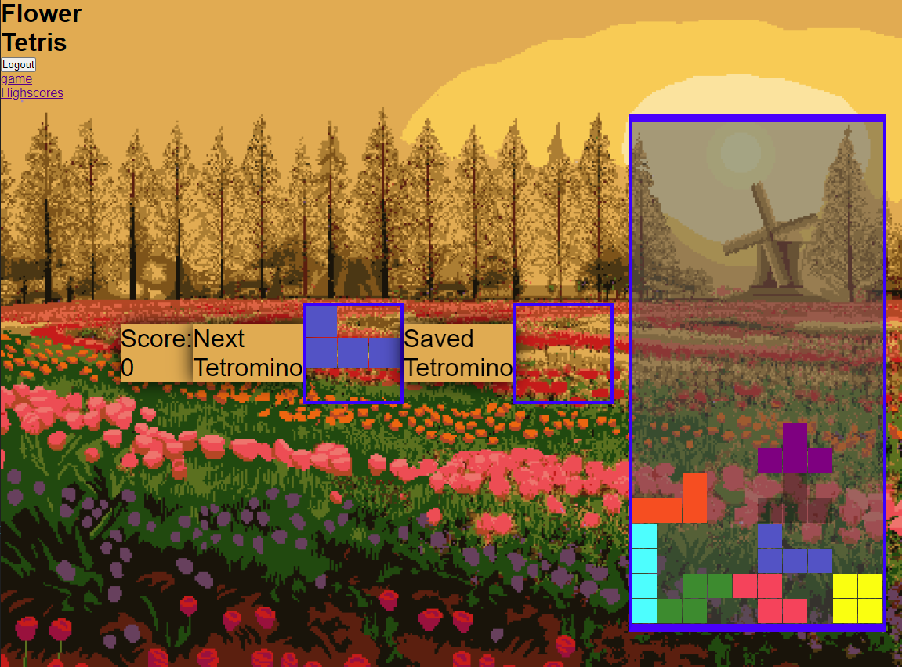

# Flower-Tetris
Tetris game that saves user scores and allows you to comment on them

## Description

This application allows users to create a profile and log comments on user's saved high scores.
Uses mysql to store account information, and bcrypt for security.

## Installation

Follow the deployed link where you will need to first create an account or log in. Use the navigation to either play the game, or view high scores and comments.

## Usage

Play more games to get the highest score you can!
Comment on high scores!

## Credits

Developed By:
Adam Robinson, August Moehring, Bryton Russell, Lawthoua Xiong, Toumeng Yang
